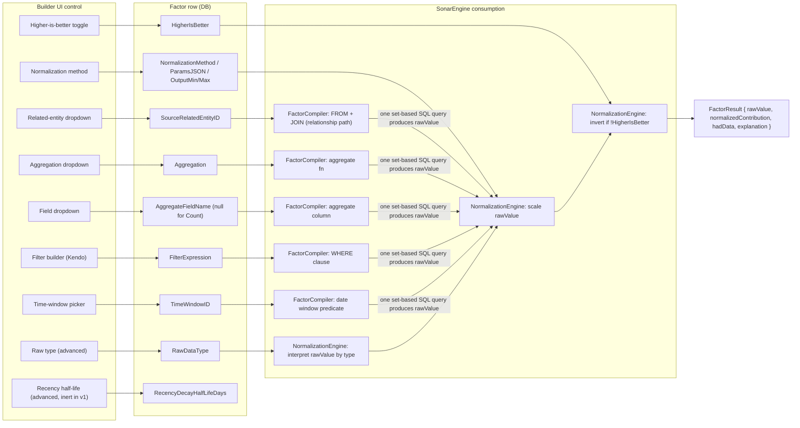
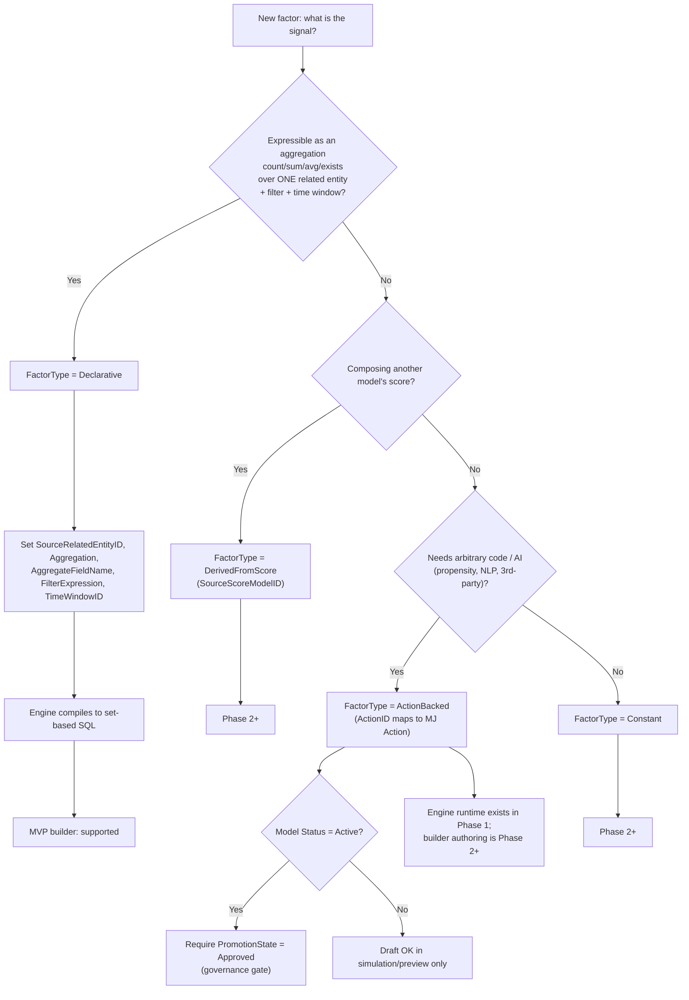
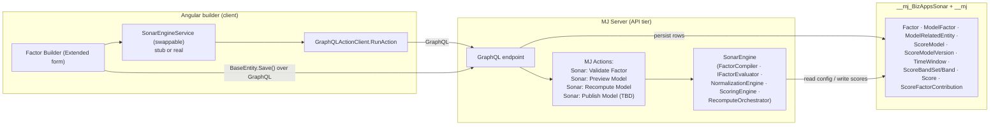
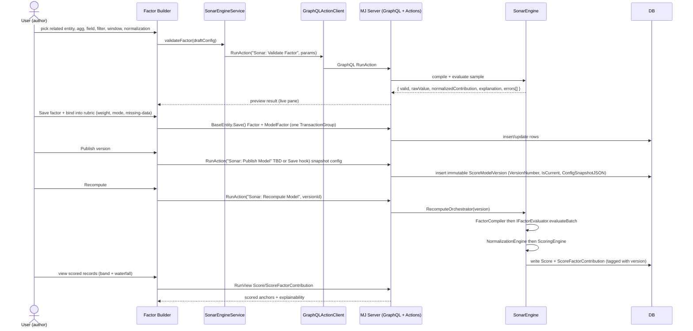

# Sonar Factor Builder — Design Plan

**Purpose.** This is the engineering design plan for the Sonar *factor builder* — the screen where a user authors the signals that drive an engagement score — and how that builder connects to the server-side `SonarEngine` that actually computes scores. It is the centerpiece of the MVP.

**How to read this.** Start with **MVP Scope** — it is the spine; every later section serves it. Then the four numbered Q&A sections answer the questions you flagged, in order. After that: UI design, the engine-integration contract, a phased build sequence, and a gap analysis of things not yet addressed. Diagrams are inline where they help.

**Jargon, defined once up front (you'll see these terms throughout):**
- **MJ / MemberJunction** — the platform Sonar is built on. It stores all data as *entities* (logical tables) described by *metadata*.
- **Entity** — MJ's notion of a table, but referenced by a logical name + GUID, not a physical table name. Sonar references entities, never raw tables. This is what makes a model portable across deployments.
- **Anchor entity** — the thing you are scoring (e.g. `Member`). A model scores one row per anchor record.
- **Related entity** — an entity reachable from the anchor via a relationship (e.g. `Invoices`, `crm_activity`). Factors read from these.
- **Factor** — one signal (e.g. "newsletter engagement over 90 days"). Defined as one `Factor` row.
- **Rubric** — the set of factors bound into a model with weights. Each binding is one `ModelFactor` row.
- **Declarative factor** — a factor defined purely as config (aggregation + filter + window + normalization) that the engine compiles to SQL. The MVP builder authors only this kind.
- **Action** — an MJ unit of server-side executable logic, invoked through GraphQL. We use Actions as the engine's RPC surface.
- **Normalization** — converting a raw number (count, days, dollars) onto a common scale (e.g. 0–1) so factors are comparable.
- **`ScoreModelVersion`** — an immutable snapshot of a model's config, created on publish. Every score records which version produced it.

> **Critical framing — schema permits ≠ engine supports (now confirmed from source).** The migration SQL is a *schema* contract: its CHECK constraints define which enum values are *legal to store*, not which the v1 engine can actually *compile and run*. The engine lives on the **`sonar_engine` branch** (not yet merged to this branch), so it was read directly via `git show sonar_engine:packages/Engine/src/...`. **Confirmed v1 capability** (cite: `factorSql.ts`, `NormalizationEngine.ts`, `FactorCompiler.ts`, `ScoringEngine.ts`):
> - **FactorType:** `Declarative` only (`FactorCompiler` throws on anything else).
> - **Aggregations:** `Count`, `Sum`, `Avg`, `Min`, `Max`, `DistinctCount`. `Exists`, `Recency`, `RatePerPeriod`, `TrendSlope` **throw** (`factorSql.ts:116-141`).
> - **Normalization:** `None`, `MinMax` only (`NormalizationEngine.ts:43-46`); all others unimplemented.
> - **Windows:** `Rolling` only. **Joins:** single-hop. **Combine:** `WeightedSum` only.
>
> The builder's enum dropdowns gate to **exactly this confirmed set** — never the raw CHECK enum (offering an unimplemented value fails at recompute). Re-verify when `sonar_engine` merges, in case the engine widened.

> Authoritative sources used throughout: plan at `/Users/barnattwu/Blue Cypress/Sonar Dev/bizapps-sonar/plans/plan.md`; schema at `/Users/barnattwu/Blue Cypress/Sonar Dev/bizapps-sonar/migrations/V202606121005__v0.1.x_Initial_Schema.sql`; mockups under `/Users/barnattwu/Blue Cypress/Sonar Dev/bizapps-sonar/plans/mockups/`.

---

## MVP Scope

This section anchors the whole document. If a design choice elsewhere doesn't serve the happy path below, it's out of scope.

### The single end-to-end happy path

The MVP must support exactly this ordered flow, all the way through, for **one anchor entity (Member) using only Declarative factors**:

0. **Create the `ScoreModel` row** (Name, `Slug` [UQ, NOT NULL], `Status='Draft'`, later `AnchorEntityID` + `BandSetID`). This happens on a **separate surface from the Factor builder** — the briefs describe no ScoreModel-creation screen, so it is an explicit MVP gap (see gaps).
1. **Select an anchor entity** for the model (writes `ScoreModel.AnchorEntityID` → `__mj.Entity`).
2. **Wire in 1+ related entities** — create `ModelRelatedEntity` rows (alias + relationship path + join type) from MJ relationship metadata.
3. **Author 1+ Declarative factors** in the builder — each is a `Factor` row.
4. **Bind factors into the model's rubric** with weights — each binding is a `ModelFactor` row.
5. **Pick / confirm a `ScoreBandSet`** — set `ScoreModel.BandSetID`.
6. **Publish a `ScoreModelVersion`** through the validation gate (immutable config snapshot).
7. **Trigger a recompute** of the published version.
8. **View scored anchor records** with band + explainability (the signed per-factor waterfall).

Everything in this plan exists to make this spine work cleanly.

### In scope (MVP)

- One anchor entity: **Member** (engine is entity-agnostic; we just don't build the picker breadth yet — plan §13.8).
- **Declarative factors only** in the builder — `FactorType = 'Declarative'`.
- **Aggregations (confirmed v1 — `factorSql.ts:116-141`):** `Count`, `Sum`, `Avg`, `Min`, `Max`, `DistinctCount`. `Exists`, `Recency`, `RatePerPeriod`, `TrendSlope` are in the CHECK enum but **throw** in the compiler — out of v1 (see "Aggregation–machinery coupling" below for why the deferred ones also lack UX inputs).
- Single-hop related entities (direct FK from related → anchor) — confirmed (`FactorCompiler` expects exactly one FK).
- **`Rolling` time windows only** — confirmed (`FactorCompiler.ts:177` throws on any other `WindowType`). `RenewalRelative` (the mockup's trend factor) and `Calendar`/`SinceEvent`/`AllTime` are **Phase 2+**.
- **Normalization (confirmed v1 — `NormalizationEngine.ts:43-46`):** `None`, `MinMax` only. `Percentile`, `ZScore`, `Logistic`, `Banded`, `Lookup` exist in the CHECK enum but are **unimplemented** — out of v1. (Note: the plan's earlier "Percentile default" recommendation is therefore **Phase 2+**; v1 default is `MinMax`.)
- **Combine strategy:** **`WeightedSum` only** — confirmed (`ScoringEngine.ts:55`). Matches the signed additive waterfall (`−22`, `+8`). `WeightedAvg`/`Banded`/`ZScoreComposite`/`ExpressionDriven` are in the enum but unimplemented — Phase 2+.
- Rubric binding with `WeightMode` ∈ {`Additive`, `Penalty`} for v1 (the two the mockup actually uses); `Multiplier`/`Gate`/`Bonus` exist in schema but defer their UX.
- `MissingDataPolicy` per binding (`Zero`/`NeutralMidpoint`/`Exclude`/`ModelDefault`).
- One `ScoreBandSet` selectable per model.
- Publish → immutable `ScoreModelVersion`; on-demand recompute trigger; view scores + explainability.
- A **"Validate Factor"** preview path (an MJ Action) powering the live right-pane preview.

#### Aggregation–machinery coupling (why Recency/RatePerPeriod/TrendSlope are out of v1)

Three permitted aggregations require inputs this MVP has deliberately deferred — so they cannot be "in scope" while their machinery is "out of scope":

- **`Recency`** and the `recency-decay` modifier depend on `Factor.RecencyDecayHalfLifeDays`, which has no preview/validate semantics defined in MVP. Pulling `Recency` in would require specifying half-life UX and engine handling.
- **`TrendSlope`** depends on the `RenewalRelative` window (the mockup's `TrendSlope` factor uses "window: RenewalDate −90d"), which is Phase 2+, plus `ModelFactor.TrendWeight` and the model-level `TrendWindowDays`, neither of which the MVP rubric UX wires.
- **`RatePerPeriod`** needs per-period windowing semantics not covered by the simple `Rolling` window set.

**Decision:** keep `Recency`/`RatePerPeriod`/`TrendSlope` out of the v1 aggregation allow-list. Revisit when their inputs (`RecencyDecayHalfLifeDays` UX, `RenewalRelative` windows, `TrendWeight`/`TrendWindowDays`) come back in Phase 2+.

### Out of scope / Phase 2+ (each verified against the engine schema)

- **AI / agent authoring** (Model Builder agent). The schema supports it (`Factor.CreatedByAgent`), but generation is not MVP. Phase 2+.
- **`ActionBacked` factors in the builder.** Per Brief 1 §5/§11 the engine's **ActionBacked runtime + the `ActionPromotion` gate ship in engine Phase 1** (binding existing/approved Actions); only CodeSmith *generation* of Runtime Actions is the Phase-2 cut line. So the constraint here is on the **builder**, not the engine: the v1 *builder* authors **Declarative only** and does not expose ActionBacked authoring. Schema has all the fields (`ActionID`, `ExecutionMode`, etc.). Phase 2+ for the builder.
- **`DerivedFromScore` factors** (`SourceScoreModelID`) — model composition. Schema supports it; out of MVP (plan §11). Phase 2+.
- **`Constant` factors** — low value for the demo; defer.
- **Multi-hop joins** (`RelationshipPath` beyond direct FK). Schema stores arbitrary paths, but the compiler's auto-traverse is a Phase-0 spike risk (plan §10.2a/§12). MVP = single-hop only.
- **Non-Rolling windows** beyond what seed data trivially provides — esp. `RenewalRelative` per-member dynamic windows (the highlighted mockup factor). Phase 2+.
- **`Recency`/`RatePerPeriod`/`TrendSlope` aggregations** — deferred with their machinery (see coupling note above). Phase 2+.
- **Advanced normalization** beyond the confirmed allow-list; calibrated/benchmark normalization (`IsCalibrated`, `BenchmarkDistribution`). Phase 2+.
- **`WeightedAvg` / `Banded` / `ZScoreComposite` / `ExpressionDriven` combine strategies** — MVP uses `WeightedSum` only. Phase 2+.
- **Write-back / action & lift layer** (acting on scores). Phase 2+.
- **Calibration** against benchmark distributions. Phase 2+.
- **Incremental recompute** — population-relative normalization forces full-population passes (plan §6.2). MVP = full recompute on demand.
- **Action-promotion governance UI** (`ActionPromotion` queue) — only needed once the builder exposes `ActionBacked` authoring. Phase 2+.
- **`CombineExpression` / formula escape hatch** — `ExpressionDriven` is Phase 2+.

### Definition of done — the factor-builder slice specifically

The factor-builder slice is done when:
1. A user can open the builder on a model whose anchor + related entities are already wired, and create a new **Declarative** `Factor` entirely through the two-pane UI.
2. Every UI control maps 1:1 to a real `Factor` field (see Factor Anatomy below); no invented fields.
3. Entity/field pickers are **metadata-driven** (read from `EntityInfo`/`EntityFieldInfo`). Enum dropdowns are gated to a **hand-curated MVP allow-list confirmed against the compiler** — **not** auto-derived from the CHECK enum. (`EntityFieldValues` mirror the DB CHECK constraint, which is a superset of engine capability; offering an unimplemented value would fail silently at recompute.)
4. `FilterExpression` is authored via `mj-filter-builder` producing a Kendo `CompositeFilterDescriptor`.
5. The right pane shows a **live preview** (raw value + normalized contribution + a sample explanation) by calling the **"Sonar: Validate Factor"** Action; if the engine isn't merged yet, a stubbed `SonarEngineService` returns deterministic fake results so the UI is fully exercisable.
6. **Save** persists the `Factor` row via `BaseEntity.Save()` through the normal MJ GraphQL pipeline, and binding it adds a `ModelFactor` row in the same `TransactionGroup`.
7. Validation errors from the compiler/validator surface inline in the preview pane.
8. `Slug` is checked for collisions before save (no DB uniqueness on `Factor.Slug`) — see gaps for the exact check and scope.

---

## 1. How is a factor defined from the user's POV?

From the user's point of view, **a factor is one named, reusable signal that produces a number, gets put on a common scale, and contributes to a score.** Plan §4.3 states the contract precisely: a factor satisfies `Factor(anchorRecord, asOfWindow, context) → { rawValue, normalizedContribution, explanation }`. Examples: "Newsletter engagement," "Cert lapsed," "Dues paid on time."

In the mockup (`builder/model.html`), each factor is one card with a **mono "spec string"** that reads left-to-right as a pipeline:

```
<related_entity> · <Aggregation(args)> · <window> · <Normalization> · <modifier>
e.g.  crm_activity · Count(Open,Click) · 90d · Percentile · recency-decay
```

So to author a factor, the user answers: *which related entity, what aggregation over which field, filtered how, over what time window, normalized how, and which direction is "good."*

> Note on `Count(Open,Click)`: the args are a **filter on Type**, not a field being aggregated. A `Count` has no `AggregateFieldName` — its selectivity lives entirely in `FilterExpression` (`Type in (Open, Click)`). See §2 for the field-requiredness rules.

### The data-source question (read this carefully — you flagged confusion here)

The docs say to **ignore ETL / data-sourcing and assume the data is already in MJ** (plan §1, §2.4). That instruction is about scope, not about how a factor names its data. Concretely:

- **A factor's "data source" is NOT a raw database table or column.** It is **an MJ entity** (the logical, metadata-described thing) **and a field on that entity**.
- **A factor's "data source" is NOT an integration / pipeline / connector.** Sonar does no ETL. Whatever subsystem (Salesforce, Finance, LMS) put the data into MJ already ran; from Sonar's POV the data simply *exists* as MJ entities. The `SourceSystemTag` on a related entity (e.g. `Salesforce`) is **informational provenance only** — a label, not a connection.

How a factor actually references its data, in two steps:

1. **The model first wires in the related entity.** A `ModelRelatedEntity` row declares "this MJ entity is reachable from the anchor, here's the alias and the join path." Its `RelatedEntityID` points at `__mj.Entity` (entity metadata), `Alias` is a friendly handle like `invoices`, and `RelationshipPath` is the traversal from anchor→related, resolved against **MJ relationship metadata** (the mockup's panel is literally titled "Related entities wired in (from MJ relationship metadata)").

2. **The factor points at that wired-in entity.** A Declarative `Factor` sets `SourceRelatedEntityID` → the `ModelRelatedEntity` row (for model-scoped factors), or `SourceEntityID` → `__mj.Entity` (for library factors). The field it aggregates is `AggregateFieldName` — a **field name from `EntityInfo` metadata**, not a column from a schema dump.

The payoff (plan §4.3.1): because everything is an entity reference, "the model is portable across deployments where the same logical entity has a different physical table."

**Decision rule for the user:** *"Pick the wired-in related entity (from the dropdown of aliases), then pick the field on it (from the metadata field list). If the entity you want isn't in the dropdown, it isn't wired into the model yet — go wire it as a related entity first. If the data isn't in MJ at all, it's out of scope (integration's job, not yours)."*

> Phase 0 dependency (plan §10.2a, §12): the auto-traverse relies on MJ relationship metadata being rich enough to map anchor→related. Fallback is a hand-edited `RelationshipPath`. MVP scopes this to **single-hop direct FKs**, which `EntityInfo.RelatedEntities` / `ForeignKeys` can resolve today.

---

## 2. How is a factor built from the UI into our backend?

The builder constructs one `Factor` entity row, saves it through MJ's standard client→server pipeline, then `ModelFactor` binds it into a model, and the engine reads the row and compiles it. End to end:

### UI control → `Factor` field mapping

Every control in the builder writes a real column on the `Factor` table (schema lines 180–226). For a **Declarative** factor:

| UI control | `Factor` field | Notes |
|---|---|---|
| Factor name | `Name` | NVARCHAR(200), required |
| Slug (auto from name) | `Slug` | required; **no DB uniqueness constraint** — enforce in UI (see gaps) |
| Description | `Description` | optional |
| Model context (implicit) | `ScoreModelID` | the model being edited; null = library factor |
| Anchor (implicit, from model) | `AnchorEntityID` | → `__mj.Entity`, required |
| "Declarative" (implicit in MVP) | `FactorType` | always `'Declarative'` in MVP builder |
| Related-entity (alias) dropdown | `SourceRelatedEntityID` | → `ModelRelatedEntity` |
| Filter builder | `FilterExpression` | Kendo `CompositeFilterDescriptor` JSON |
| Aggregation dropdown | `Aggregation` | engine enum (gated to MVP allow-list) |
| Field dropdown (aggregatable fields) | `AggregateFieldName` | from `EntityInfo.Fields`; **null for `Count`** (see field-requiredness below) |
| Time-window picker | `TimeWindowID` | → `TimeWindow` |
| Recency half-life (advanced) | `RecencyDecayHalfLifeDays` | INT; only relevant to deferred `Recency` — hidden/inert in v1 |
| Raw type (advanced) | `RawDataType` | enum; tells `NormalizationEngine` how to interpret rawValue |
| Normalization method | `NormalizationMethod` | enum (gated to MVP allow-list) |
| Normalization params (advanced) | `NormalizationParamsJSON` | JSON |
| Output min/max (advanced) | `OutputMin` / `OutputMax` | DECIMAL(9,4) |
| "Higher is better" toggle | `HigherIsBetter` | BIT, default 1 |
| (governance, mostly hidden in MVP) | `PromotionState`, `LastValidatedAt`, `CreatedByAgent` | not needed for Declarative production use |

**Field-requiredness by aggregation (important — don't force a meaningless field pick; rules confirmed in `factorSql.ts`):**
- **`Count`** → `AggregateFieldName` is **null** (compiles to `COUNT(*)`); selectivity comes entirely from `FilterExpression`. The field dropdown is hidden/disabled.
- **`Sum`, `Avg`, `Min`, `Max`, `DistinctCount`** → `AggregateFieldName` is **required** (`buildAggregateExpression` throws without it); pick a field from `EntityInfo.Fields` (numeric `TSType==='number'` for `Sum`/`Avg`; any type for `DistinctCount`).
- (`Exists` would be the other field-free aggregation, but it **throws** in v1 — not offered.)

The weight chip + slider + polarity in the mockup are **not** `Factor` fields — they belong to the **binding**, `ModelFactor`: `Weight`, `WeightMode` (`Additive`/`Penalty`/…), `ContributionCap`/`ContributionFloor` (note: the column is `ContributionFloor`, schema line 239 — there is no field named `Floor`), `TrendWeight`, `MissingDataPolicy`, `DisplayLabel`, `DisplayOrder`. Keep `Factor` (the definition) and `ModelFactor` (the weighted binding) distinct — this is the core split.

### The save path (client → GraphQL → server)

The builder is implemented as an **Extended form** over the generated Factor form (details in the UI section). On save:

1. `SaveRecord()` (inherited from `BaseFormComponent`) runs `Validate()` then `InternalSaveRecord()`.
2. `InternalSaveRecord()` calls **`await this.record.Save()`** — `BaseEntity.Save()` — which serializes the row and sends it over **GraphQL** to the MJ server, where it lands as a `Sonar: Factors` row in `__mj_BizAppsSonar.Factor`.
3. The binding row (`ModelFactor`) is created as a **pending child record** so MJ wraps both saves in one `TransactionGroup` (`md.CreateTransactionGroup()` + `tg.Submit()`) — Factor + ModelFactor commit atomically.

### Then the engine reads it

The published model snapshots into a `ScoreModelVersion`. At recompute, the engine's `FactorCompiler` reads the `Factor` row and, because `FactorType='Declarative'`, compiles its config (`SourceRelatedEntityID` + `FilterExpression` + `Aggregation` + `AggregateFieldName` + `TimeWindowID`) into **one set-based SQL query** over the whole population (plan §6.1 step 2). It runs behind the uniform `IFactorEvaluator.evaluateBatch(...)` seam — the rest of the engine never knows it was Declarative.

#### Factor Anatomy: UI control → `Factor` field → engine consumption



---

## 3. What determines if a factor is declarative or action-based?

**The deciding field is `Factor.FactorType`** (NVARCHAR(20), CHECK enum: `'Declarative'`, `'ActionBacked'`, `'DerivedFromScore'`, `'Constant'`). The schema groups the other columns by which type uses them — Declarative uses the aggregation/filter/window block; ActionBacked uses the `ActionID`/`ExecutionMode`/concurrency block.

### User-POV decision rule

> *"If the signal is **'count / sum / average / does-this-exist' over a related entity, with a filter and a time window** — it's **Declarative**. That's about 80% of real factors, and it's pure config that becomes SQL. If the signal needs **arbitrary logic** the engine can't express as an aggregation — an external propensity model, NLP sentiment over community posts, a blended third-party score — it's **Action-backed**: it points at an MJ Action that runs code."*

In the mockup the AI panel demonstrates this exact judgment: it flags that a proposed community-sentiment factor "needs a custom Action," i.e. it can't be declarative.

### Technical reality (be honest with the user)

- **The v1 *builder* authors `Declarative` only.** This is a *builder* constraint, not an engine one. Per Brief 1 §5/§11, the engine's `ActionBacked` runtime + the `ActionPromotion` governance gate **ship in engine Phase 1** (binding existing/approved Actions); the engine therefore *can* execute ActionBacked factors. The v1 factor builder simply doesn't expose ActionBacked authoring. So in the MVP builder, `FactorType` is effectively pinned to `'Declarative'`, while the `IFactorEvaluator` ActionBacked branch is a real (not stubbed) engine path.
- **`ActionBacked` authoring is Phase 2+** for the builder. When it lands: the factor sets `ActionID` → `__mj.Action`, plus `ActionParamsJSON`, `ExecutionMode` (`PerRecord`/`Batch`), `IsExpensive`, `MaxConcurrency`, `RateLimitPerMinute`, `CacheTTLSeconds`. Governance applies: a production (`Active`) model may bind only an `Approved` Action-backed factor (`Factor.PromotionState`); drafts run in simulation/preview only (plan §7.4).
- **`DerivedFromScore` and `Constant` are Phase 2+** as well.

The crucial invariant either way (plan §5.2, the most important seam in the codebase): both kinds satisfy the **same `IFactorEvaluator` contract**, returning `FactorResult = { rawValue, normalizedContribution, hadData, explanation }`. The rubric, normalization, and explainability stages **must never branch on `FactorType`.** In the MVP this means: even though the builder only authors Declarative, write the UI and the engine seam so adding `ActionBacked` authoring later is purely additive.

#### Decision flow: Declarative or Action-backed?



---

## 4. How is it all hooked up?

Full wiring from builder to scored records, plus the preview/validate path. Note: stages from `RecomputeOrchestrator` onward are **server-side engine components** described in the plan; the builder integrates with them through MJ Actions, not by calling them directly.

### The chain

1. **Builder UI** authors a `Factor` (and the model's `ModelRelatedEntity` rows) and binds it via `ModelFactor` (weight + mode + missing-data policy).
2. **`BaseEntity.Save()` → GraphQL → server** persists those rows in `__mj_BizAppsSonar`.
3. **Publish** snapshots the model's config into an **immutable `ScoreModelVersion`** (the mockup's "Publish version" button; "every score records the `ScoreModelVersion` that produced it"). *Mechanism (Save hook vs. Action) is undecided — see gaps.*
4. **`RecomputeOrchestrator`** (engine) runs a recompute for that version over the population.
5. **`FactorCompiler`** compiles each Declarative `Factor` to one set-based SQL query.
6. Each factor is evaluated behind **`IFactorEvaluator.evaluateBatch(anchorIds, asOf, ctx) → Map<anchorId, FactorResult>`** — the seam that hides Declarative-vs-Action.
7. **`NormalizationEngine`** computes population stats (for `MinMax` — the min/max across the population) and maps each `rawValue` → `normalizedContribution` (`None` passes through). Higher-is-better inversion is applied per the factor's `HigherIsBetter` flag.
8. **`ScoringEngine`** applies the rubric (`ModelFactor` weights/modes/caps/floors, `MissingDataPolicy`) and the model's `CombineStrategy` (`WeightedSum` in MVP) to produce a composite **Score**.
9. **`Score` rows** are written, each tagged with its `ScoreModelVersion`. Per-factor `ScoreFactorContribution` rows (`RawValue`, `NormalizedValue`, `WeightedContribution`, `PercentOfTotal`, `HadData`) are the **explainability spine** — they back the signed waterfall (`−22 cert lapsed`, `+8 events`).
10. **Score views** read these rows + bands (`ScoreBandSet`/`ScoreBand`) to show band + delta + waterfall.

### The preview / validate path (interactive, no full recompute)

For the live right-pane preview and for "Simulate," the builder calls an MJ **Action** via `GraphQLActionClient.RunAction(...)`, which runs the engine's evaluate logic on a single sample or a small sample — **not** a full recompute. The builder talks to a **swappable `SonarEngineService`** client: stubbed today (deterministic fake `FactorResult`s so the UI is fully usable before the engine merges), real once the engine PRs land.

> **Preview requires persisted prerequisites.** `FactorCompiler` consumes a config whose `SourceRelatedEntityID` must resolve to a persisted `ModelRelatedEntity` row (FK target). So preview of a draft *Factor* assumes its related entity is already saved (it's a happy-path prerequisite anyway). The `Sonar: Validate Factor` Action must accept an **inline draft config object** (not just a saved `Factor` row) — confirm with the engine team that the compiler can evaluate from a transient config referencing a persisted `ModelRelatedEntity`.

#### Integration architecture



#### End-to-end sequence: build → save → publish → recompute → score



---

## Recommended UI design

A **two-pane custom builder** (matches `builder/model.html`):

```
+---------------------------------------------------------------------------------+
|  Factor: Newsletter engagement            [Validate]            [Save]  [Cancel] |
+----------------------------------------+----------------------------------------+
|  LEFT — sentence / mad-libs composer    |  RIGHT — live preview                  |
|                                         |                                        |
|  Count  events in                       |  Sample member: Maria Chen             |
|  [ crm_activity (Activities) ▼ ]        |  ----------------------------------    |
|  where [ ⛭ filter: Type in (Open,Click)]|  Raw value:        14 events           |
|  over  [ Last 90 days ▼ ]               |  Normalized:       0.62  (MinMax)      |
|  normalized by [ MinMax ▼ ]             |  Contribution:     +0.62               |
|  higher is [ better ▼ ]                 |  Explanation:                          |
|   (field picker hidden for Count)       |   "14 Open/Click activities in 90d,    |
|                                         |    0.62 of pop. min–max range."         |
|  ▸ Advanced fields (disclosure)         |  ----------------------------------    |
|     Raw type · Norm params · slug       |  ⚠ Validation: OK                      |
|     Output min/max                      |  (powered by "Sonar: Validate Factor") |
+----------------------------------------+----------------------------------------+
```

**Left pane — sentence/mad-libs composer.** Render the factor as an editable sentence whose **tokens map 1:1 to `Factor` fields** (the table in §2). Each token is an inline editor:
- Related-entity token → `mj-dropdown` populated from the model's `ModelRelatedEntity` aliases → writes `SourceRelatedEntityID`.
- Aggregation token → `mj-dropdown` gated to the **confirmed v1 set** (`Count`, `Sum`, `Avg`, `Min`, `Max`, `DistinctCount`), **not** the raw CHECK enum (which includes `Exists`/`Recency`/etc. that throw).
- Field token → `mj-dropdown`/`mj-combobox` of the related entity's fields from `EntityInfo.Fields` (numeric `TSType==='number'` for `Sum`/`Avg`) → writes `AggregateFieldName`. **Hidden/disabled when the aggregation is `Count`** (which leaves `AggregateFieldName` null and expresses selectivity via the filter).
- Filter token → opens **`mj-filter-builder`** (`[fields]` built from `EntityFieldInfo`, including `valueList` from `EntityFieldValues`) → writes `FilterExpression` (Kendo `CompositeFilterDescriptor`).
- Window token → `mj-dropdown` of `TimeWindow` rows → writes `TimeWindowID`.
- Normalization token → `mj-dropdown` gated to the **confirmed v1 set** (`None`, `MinMax`) → writes `NormalizationMethod`. (`Percentile`/`ZScore`/etc. are Phase 2+.)
- "Higher is" token → `mj-switch`/`mj-dropdown` → writes `HigherIsBetter`.

An **"Advanced fields" disclosure** (`mj-accordion`) holds the rarely-touched columns: `RawDataType`, `NormalizationParamsJSON`, `OutputMin`/`OutputMax`, `Slug`. (`RecencyDecayHalfLifeDays` stays here too but is inert until `Recency` returns in Phase 2+.) Render the collapsed summary as the mono **spec string** (`crm_activity · Count(Open,Click) · 90d · MinMax`) so a saved factor reads at a glance.

**Right pane — live preview.** On debounce after any token edit, call `SonarEngineService.validateFactor(draftConfig)` → **"Sonar: Validate Factor"** Action → shows raw value, normalized contribution, a sample explanation, and inline validation errors from the compiler. Use `<mj-loading>` while in-flight.

**Metadata-driven everywhere — but enum allow-lists are curated, not derived.** All pickers read MJ metadata at runtime via `new Metadata()` → `EntityByName` / `EntityInfo.Fields` / `EntityFieldValues` / `EntityInfo.RelatedEntities`. **Enum dropdowns are gated to a hand-curated MVP allow-list confirmed against the compiler — not auto-populated from `EntityFieldValues`/CHECK,** because the CHECK enum is a superset of what the v1 engine implements; offering an unimplemented value would compile-fail silently at recompute.

### How to build it — Extended form, not inline-in-resource (recommended)

**Recommendation: a custom `BaseFormComponent` override (the "Extended form" pattern), not an inline component embedded in a resource view.**

- The generated form already exists and is registered as `@RegisterClass(BaseFormComponent, 'MJ_BizApps_Sonar: Factors')` at `/Users/barnattwu/Blue Cypress/Sonar Dev/bizapps-sonar/packages/Angular/src/lib/generated/Entities/mjBizAppsSonarFactor/mjbizappssonarfactor.form.component.ts`. **Do not edit it — CodeGen overwrites it.**
- Instead, write `mjBizAppsSonarFactorFormComponentExtended extends mjBizAppsSonarFactorFormComponent`, re-register with the same entity-name string. MJ's ClassFactory resolves to the last/highest-priority registration, so the Extended form wins everywhere a Factor form is opened (canonical precedent: the Lists `...Extended` form in `@memberjunction/ng-core-entity-forms`).
- **Why this over inline-in-resource:** the Extended form inherits the entire save/validate lifecycle for free (`SaveRecord` → `Validate` → `InternalSaveRecord` → `record.Save()` + `TransactionGroup`), it is reached by every entry point (grid open, FK drill-in, `MJFormPresenterService.Open(...)`), and it keeps the rich UI cleanly separated from generated code. An inline-in-resource component would have to re-implement saving and wouldn't be the default editor for the entity.
- Place the Extended form in a **non-generated module** under `packages/Angular` (CodeGen owns the generated module). For binding-into-rubric, register the `ModelFactor` row as a **pending child record** so it rides the same `TransactionGroup`.
- Host/open it via `MJFormPresenterService.Open({ Presentation: 'slide-in' | 'dialog' })` or `MjEntityFormHostComponent` from the model builder screen.

**Reuse vs hand-build:** reuse `BaseFormComponent`, the host/presenter, `record.Save()`, `Metadata`/`EntityInfo`/`EntityFieldInfo`, `mj-filter-builder`, `GraphQLActionClient.RunAction`, and the field inputs (`mj-dropdown`, `mj-combobox`, `mj-numeric-input`, `mj-form-field`, `mj-record-selector`). Hand-build only the mad-libs composer logic, the metadata→token wiring, the aggregation→field-requiredness rules, the spec-string renderer, the pending-`ModelFactor` registration, the slug-collision check, and the name→ID resolution before `RunAction`.

---

## Engine-integration contract

Server-side MJ Actions form the contract between the builder and `SonarEngine`. The client reaches them through one swappable service.

**Actions (add server-side):**

1. **`Sonar: Validate Factor`** — powers the live preview. *Inputs:* the draft factor config (the `Factor` field set, even if unsaved, referencing a **persisted** `SourceRelatedEntityID`) + optional sample anchor id(s). *Outputs:* `{ Valid: boolean; Errors: string[]; RawValue?: number; NormalizedContribution?: number; HadData: boolean; Explanation?: string }`. Compiles the factor and evaluates it on a sample (no persistence, no full recompute). Must accept an inline transient config (finding above).
2. **`Sonar: Preview Model`** — powers "Simulate" and the live band distribution. *Inputs:* `ScoreModelID` (or draft model config) + sample size (default 5%). *Outputs:* `{ BandDistribution: {label,pct}[]; SampleMember: {score, band, delta, contributions: {label, value}[]}; Errors: string[] }`. (Distinct from publish — do not conflate.)
3. **`Sonar: Recompute Model`** — runs the full recompute. *Inputs:* `ScoreModelVersionID`. *Outputs:* `{ RunID; Status; RecordsScored; Errors: string[] }`.
4. **`Sonar: Publish Model` (TBD — mechanism undecided).** Either this Action or a `BaseEntity.Save` hook snapshots the model config into a `ScoreModelVersion` (`VersionNumber`, `IsCurrent`, `ConfigSnapshotJSON`) through the validation gate. Decide which before building happy-path steps 6–7 (see gaps).

> **Casing note (don't "fix" it):** MJ `ActionParam` outputs are PascalCase (`{ RawValue, NormalizedContribution, HadData, Explanation }`); the client-side TS contract uses camelCase (`{ rawValue, normalizedContribution, hadData, explanation }`). This is the MJ ActionParam ↔ TS boundary convention, intentional — do not normalize one to match the other.

**Invocation pattern (from Brief 4):** resolve Action **name → ID (GUID)** first via `RunView` over the MJ-core Actions catalog entity — **confirm the literal entity name (`'Actions'` vs `'MJ: Actions'`) against `Metadata.Entities` before coding, since a wrong string silently returns zero rows.** Then `new GraphQLActionClient(GraphQLDataProvider.Instance).RunAction(actionID, params)` with `ActionParam[] = [{Name, Value, Type:'Input'}]`; read outputs from `result.Params` where `Type ∈ {'Output','Both'}`.

**Swappable `SonarEngineService` (client):**
```
interface SonarEngineService {
  validateFactor(draft): Promise<ValidateFactorResult>;
  previewModel(modelId, sampleSize): Promise<PreviewModelResult>;
  recomputeModel(versionId): Promise<RecomputeResult>;
  publishModel(modelId): Promise<PublishResult>; // mechanism TBD
}
```
- **`StubSonarEngineService`** (now) — returns deterministic fake `FactorResult`s and a fixed band distribution so the entire builder UI is exercisable before any engine PR merges.
- **`ActionSonarEngineService`** (real) — implements each method via `GraphQLActionClient.RunAction`. Swap by DI provider once the Action wrappers + engine PRs land. Keep the interface identical so nothing in the UI changes.

---

## Build sequence (phased)

**Phase A — buildable now, no engine dependency:**
1. Extended Factor form scaffold + non-generated module; register over `'MJ_BizApps_Sonar: Factors'`.
2. Metadata-driven pickers (related-entity aliases, fields) from `Metadata`/`EntityInfo`; enum dropdowns gated to the **hand-curated MVP allow-list**.
3. Mad-libs composer + aggregation→field-requiredness rules + advanced disclosure + spec-string renderer.
4. `mj-filter-builder` integration → `FilterExpression`.
5. Slug-collision check before save.
6. `SonarEngineService` interface + **`StubSonarEngineService`**; wire live preview pane against the stub.
7. Save path: `record.Save()` + pending `ModelFactor` in one `TransactionGroup`.
8. `ScoreModel`-creation surface, `ModelRelatedEntity`, and `ScoreBandSet` minimal authoring (see gaps) — needed to reach the happy path.

**Phase B — blocked on engine PRs:**
9. ✅ Allow-list confirmed against `sonar_engine` source: aggregations `Count/Sum/Avg/Min/Max/DistinctCount`; normalization `None/MinMax`; `Rolling` windows; `WeightedSum`; single-hop. (Re-verify when `sonar_engine` merges in case it widened.)
10. Server-side **`Sonar: Validate Factor`**, **`Sonar: Preview Model`**, **`Sonar: Recompute Model`** Actions wrapping `SonarEngine`; decide + build the publish mechanism (`Sonar: Publish Model` Action vs Save hook).
11. **`ActionSonarEngineService`**; swap DI from stub → real.
12. Publish → `ScoreModelVersion` snapshot + validation gate (sets `VersionNumber`/`IsCurrent`/`CurrentVersionID`).
13. Recompute trigger + scored-records view (Score + `ScoreFactorContribution` waterfall).
14. Seed data: `TimeWindow` rows (Rolling 30/90/365d), a default `ScoreBandSet`.

**Phase 2+ (after MVP):** AI authoring; `ActionBacked` builder authoring + `ActionPromotion` queue; `DerivedFromScore`; `Constant`; multi-hop joins; `RenewalRelative`/non-Rolling windows; `Recency`/`RatePerPeriod`/`TrendSlope` aggregations (with their machinery); calibration/benchmark normalization; `WeightedAvg`/`Banded`/`ZScoreComposite`/`ExpressionDriven` combine modes; incremental recompute; write-back/action layer.

---

## What may be overlooked / additional MVP components (gap analysis)

Things the requirements haven't fully addressed but the MVP needs. Prioritized.

**MVP-critical (the happy path is blocked without these):**

- **`ScoreModel` row creation surface (happy-path step 0).** The factor builder is an Extended *Factor* form; nothing in the briefs creates the `ScoreModel` row itself, yet the model needs `Name`, `Slug` (UQ, NOT NULL), `Status='Draft'`, `AnchorEntityID`, and `BandSetID` set before any factor can be authored. This is a **separate surface** upstream of the factor builder and must be built. Without it there is no model to attach factors to.
- **The Action wrapper itself (server-side).** The Actions above don't exist yet. Someone must author them in the MJ Actions catalog and wire them to `SonarEngine`. Without `Sonar: Validate Factor`, the live preview has no real backend (only the stub).
- **Engine capability vs. CHECK enums — confirmed (re-verify on merge).** Read directly from `sonar_engine` source: aggregations `Count/Sum/Avg/Min/Max/DistinctCount`, normalization `None/MinMax`, `Rolling` windows, `WeightedSum`, single-hop. The schema CHECK enums are a superset; the builder gates to this confirmed subset, or authors build factors that fail silently at recompute. The one residual risk: the engine isn't merged to this branch yet, so re-confirm at merge time in case it widened.
- **Where/how the engine runs (API tier).** Confirm `SonarEngine` executes in the MJ server/API tier invoked by the Action — not in the browser. The architecture diagram assumes this; verify with the engine team.
- **Anchor + related-entity (`ModelRelatedEntity`) authoring UX.** *You cannot build a factor before the model has an anchor and at least one related entity wired in.* The factor's source dropdown is empty otherwise. MVP needs a minimal screen to set `ScoreModel.AnchorEntityID` and create `ModelRelatedEntity` rows (alias + relationship path from `EntityInfo.RelatedEntities`/`ForeignKeys` + `JoinType`). Prerequisite to the factor builder, not an afterthought. (Also a prerequisite for preview — the FK target must be persisted.)
- **Band-set authoring (or at least selection).** A model needs `BandSetID`. MVP minimum: pick an existing `ScoreBandSet`; ideally a small editor for `ScoreBand` rows (label, min/max, color, severity). Without bands, step 5 of the happy path and the band distribution can't render.
- **Publish / versioning UX + its validation gate (mechanism undecided).** Resolve whether "Publish" is a `BaseEntity.Save` hook or a `Sonar: Publish Model` Action; who builds `ConfigSnapshotJSON`; who sets `ScoreModelVersion.VersionNumber` (INT NOT NULL) / `IsCurrent` and the `ScoreModel.CurrentVersionID` circular FK. **Validation gate must check:** anchor set; ≥1 related entity; ≥1 bound factor, each compiling clean; weights present; `BandSetID` set. Happy-path steps 6–7 cannot be built until this is resolved. (`ScoreModelVersion` field names are not enumerated in the briefs — pin them from the schema.)
- **`Slug` uniqueness — there is no DB constraint on `Factor.Slug`** (unlike `ScoreModel.Slug`, which has `UQ_ScoreModel_Slug`). "Enforce in UI" must be specified: before save, `RunView` for an existing `Factor.Slug` **within the chosen uniqueness scope** (decide model-scoped vs. library-wide) and block on collision. Slugs key cross-references (library-factor reuse, any future formula escape hatch), so collisions corrupt those references — this is not cosmetic.
- **`Count` field semantics.** `AggregateFieldName` must be **null** for `Count` (selectivity via `FilterExpression`); `Sum`/`Avg`/`Min`/`Max`/`DistinctCount` require a field. The UI must enforce this so an author is never forced to pick a meaningless field for a count. (`Exists` would behave like `Count` but is unimplemented in v1.)
- **Error/validation surfacing from the compiler.** The preview/validate path must return structured `Errors[]` and the UI must show them inline (bad field name, uncompilable filter, missing window). Otherwise authors hit silent failures only at recompute.
- **Seed data availability.** `TimeWindow` rows and a default `ScoreBandSet` must exist for the pickers to be non-empty on first run. Add a seed migration.
- **Who triggers recompute (MVP = on-demand).** MVP scopes to a manual "Recompute" button → `Sonar: Recompute Model`. Confirm no scheduler is required for the demo.

**Important but can be minimal in MVP:**

- **Preview against unsaved drafts.** `Sonar: Validate Factor` must compile a transient config object (no persisted `Factor` row) whose `SourceRelatedEntityID` points at a **persisted** `ModelRelatedEntity`. Confirm the engine can compile from a transient config, not only from a row.
- **Normalization parameter UX.** v1 has only `None`/`MinMax`, so `NormalizationParamsJSON` is barely used — keep it in the advanced disclosure as raw JSON. **v1 default is `MinMax`** (the plan's §13.6 `Percentile` preference is Phase 2+). Guard `MinMax` on small/sparse or single-value populations (a degenerate min==max range) — at minimum show a warning.
- **Missing-data policy UX.** `ModelFactor.MissingDataPolicy` (`Zero`/`NeutralMidpoint`/`Exclude`/`ModelDefault`) needs a control in the rubric binding (not the factor). Easy to forget since it's not on the `Factor` row.
- **Population / "as-of" concept.** A score is computed for a population as-of a window (`ScoreModel.AsOfStrategy` = `RunTime`/`EndOfPreviousDay`/`Fixed`; mockup header: "trailing windows as-of today"). MVP can default to `RunTime`/today, but it must be a deliberate default, not undefined.
- **Who can open the builder / view scores (data exposure).** RLS *enforcement* is Phase 2+ (below), but member scores are sensitive and the scored-records view (step 8) surfaces them in the demo. State the MVP default explicitly — e.g. "all authenticated users with builder access" — so it's a deliberate decision, not a silent one.
- **Empty-state / first-run experience.** New model with no anchor, no related entities, no factors — guide the user: "Set an anchor → wire a related entity → add your first factor." Prevents the dead-end empty factor builder.

**Defer to Phase 2+ (verified against engine schema/scope):**

- **Row-level security enforcement on scores.** Real RLS is post-MVP; note it now (and the MVP access default above) so it isn't bolted on later.
- **Action-promotion governance UI** (`ActionPromotion` queue) — only matters once the builder exposes `ActionBacked` authoring. Phase 2+.
- **Calibration / benchmark normalization, write-back/lift layer, incremental recompute, multi-hop joins, `RenewalRelative` windows, `Recency`/`RatePerPeriod`/`TrendSlope` aggregations, AI authoring** — all confirmed out of MVP above.

---

**Open decisions to confirm before/while building (from plan §13):**
- ~~Engine capability vs. CHECK enum~~ — **resolved** by reading `sonar_engine` source (see confirmed set above). Only residual: re-verify at merge.
- **Normalization default** — v1 default is **`MinMax`** (`Percentile` is unimplemented → Phase 2+). The plan's §13.6 "Percentile" recommendation is a Phase 2+ target.
- **Filter builder reuse** (§13.3 — Brief 4 confirms `mj-filter-builder` exists, so reuse it).
- **Anchor breadth** (§13.8 — recommend Member-only v1, engine entity-agnostic).
- **Publish mechanism** — `Sonar: Publish Model` Action vs `BaseEntity.Save` snapshot hook, plus who sets `VersionNumber`/`IsCurrent`/`CurrentVersionID`.
- **Slug uniqueness scope** — model-scoped vs. library-wide (no DB help; must enforce in code).
- **Actions catalog entity name** — confirm `'Actions'` vs `'MJ: Actions'` against `Metadata.Entities` before coding the name→ID resolution.